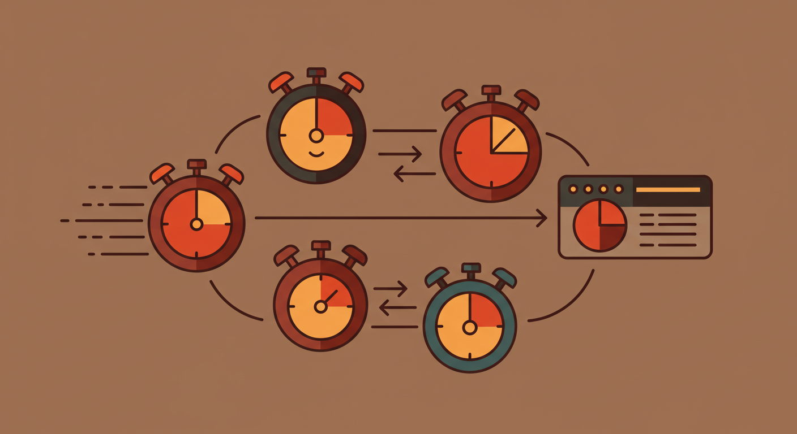

# ⏰ schedules.rs 🚀

<p align="center">
  
</p>

## ✨ A lightweight Rust library for scheduling operations across multiple time scales! ✨

## 👥 Who This Is For

This library is perfect for developers who need:
- 🎯 Simple, predictable scheduling with absolute time intervals
- 🧩 Lightweight scheduling without complex calendar-based rules
- ⚙️ Precise control over execution timing in systems programming
- 🔧 Efficient scheduling in resource-constrained environments

By design, we focus on absolute time durations (every 5 seconds, every 10 minutes) and deliberately avoid calendar-based scheduling (every Thursday, first day of month). This keeps the API clean, predictable, and easy to reason about for systems programming tasks.

## 🎯 Features

- ⚡ Multiple tick frequencies (milliseconds to minutes)
- 🕰️ Configurable time sources for ultimate flexibility
- 🔄 Compound durations (e.g., 10 minutes plus 30 seconds)
- 📝 Named schedules with intuitive fluent builder API
- 🔗 Direct callback references and event emission
- 💾 Easy serialization and state persistence
- 🔄 Both synchronous AND asynchronous execution support

## 🚀 Usage

```rust
// Create a scheduler with default settings
let mut scheduler = Scheduler::new();

// Or create with custom configuration
let config = SchedulerConfig {
    thread_count: 8,              // Use 8 worker threads
    store_capacity: 100,          // Pre-allocate for 100 schedules
    time_source: None,            // Use default time source
};
let mut scheduler = Scheduler::with_config(config);

// Register a callback handler (traditional way)
struct LogHandler;
impl CallbackHandler for LogHandler {
    fn handle(&self, event: TickEvent) {
        println!("Event fired: {:?}", event);
    }
    
    fn handle_async<'a>(&'a self, event: TickEvent) -> Pin<Box<dyn Future<Output = ()> + Send + 'a>> {
        Box::pin(async move { self.handle(event) })
    }
}

scheduler.register_callback("log_handler", Box::new(LogHandler));

// Or register a callback using the helper function (much simpler!)
scheduler.register_callback(
    "simple_logger", 
    callback_fn(|event| println!("Event: {}", event.schedule_name))
);

// Create a schedule with the registered handler
scheduler.every(Duration::from_secs(5))
    .with_name("status_check")
    .with_callback_id("log_handler")
    .build();

// For simple cases, use the convenience method
scheduler.every(Duration::from_millis(100))
    .with_name("fast_tick")
    .execute(|event| {
        println!("Fast tick: {:?}", event);
    });

// Start the scheduler
scheduler.start();

// You can manage schedules directly:
let all_schedules = scheduler.get_all_schedules();
scheduler.remove_schedule("some_id");
scheduler.clear_schedules();

// Later, freeze the state
let state = scheduler.freeze();
let serialized = serde_json::to_string(&state).unwrap();

// Restore (requires re-registering handlers)
let state: SchedulerState = serde_json::from_str(&serialized).unwrap();
let mut restored = Scheduler::restore(state);
restored.register_callback("log_handler", Box::new(LogHandler));
restored.start();
```

## ⚡ Async Support

For asynchronous operation with Tokio (requires the `async` feature):

```rust
// Enable the feature in Cargo.toml:
// [dependencies]
// schedule_rs = { version = "0.1.0", features = ["async"] }

// Create an async scheduler with default settings
let mut scheduler = AsyncScheduler::new();

// Or create with custom configuration
let config = SchedulerConfig {
    thread_count: 8,
    store_capacity: 100,
    time_source: None,
};
let mut scheduler = AsyncScheduler::with_config(config);

// Register an async handler
scheduler.register_async_handler("async_handler", |event| async move {
    println!("Async handling of event: {:?}", event);
    // Perform async operations here
    tokio::time::sleep(Duration::from_millis(100)).await;
});

// Create and start schedules as with the sync scheduler
scheduler.every(Duration::from_secs(1))
    .with_name("async_task")
    .with_callback_id("async_handler")
    .build();

scheduler.start();
```

## 📦 Installation

Add to your Cargo.toml:

```toml
[dependencies]
schedule_rs = "0.1.0"

# For async support:
schedule_rs = { version = "0.1.0", features = ["async"] }
```

## 📄 License

This project is licensed under the MIT License - see the LICENSE file for details.

## 🎉 Contribute

Contributions are welcome! Feel free to open issues and submit PRs to make schedule.rs even better!